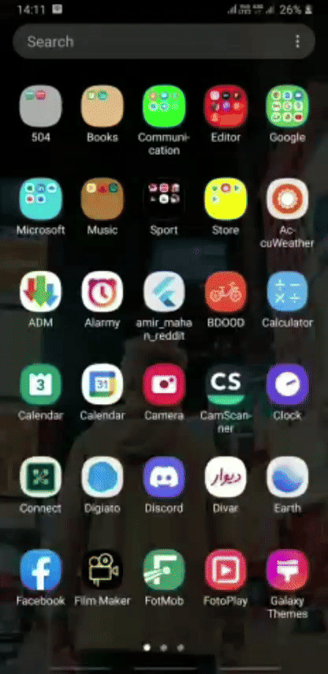
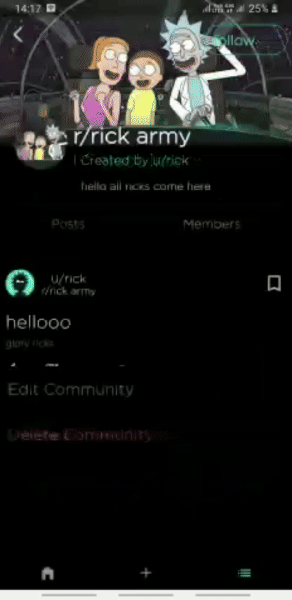
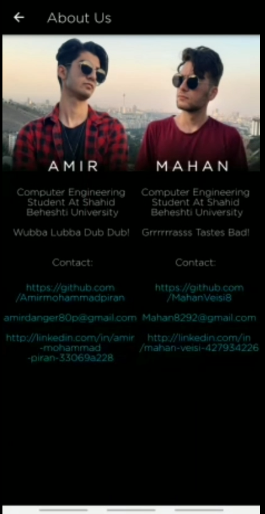

# blueIt!

blueIt! is a mobile application built using Flutter and Dart for the frontend and Java for the backend. It is a platform inspired by Reddit, featuring similar functionalities but with a blue-themed interface. All the code has been developed from scratch by our team.

## Features
- User authentication and registration
- Subreddit creation and subscription
- Post creation, upvoting, and commenting
- Messaging between users
- Customizable user profiles

## Runtime videos

<table>
  <tr>
    <td>Log in Feed </td>
    <td>Home Feed </td>
    <td>Post Creation </td>
  </tr>
</table>

## About Us

